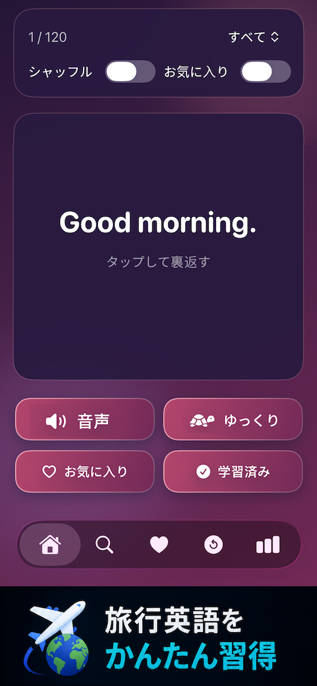
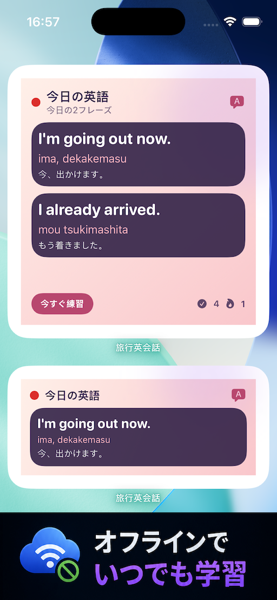
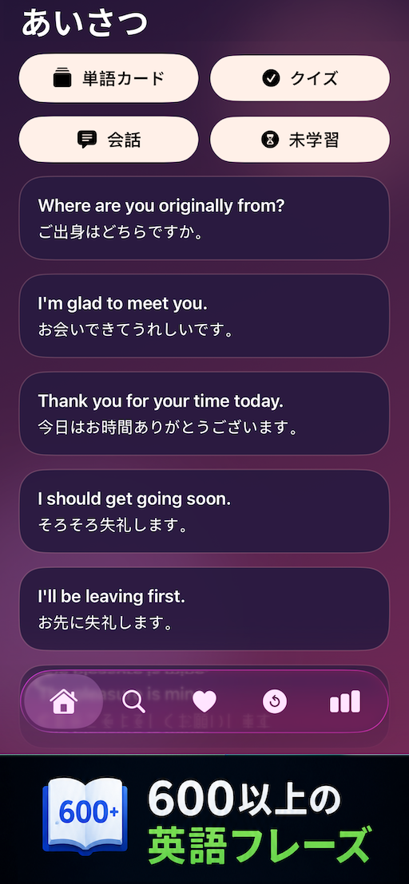

# Travel English for Japanese
# 旅行英会話 - 日本人向け英語学習

  

海外旅行で使える英語フレーズと発音

  

---

## パッと調べて、サッと話せる！

600フレーズ以上の旅行英会話。  
オフライン対応＆ゆっくり音声で、聞き取り練習もしっかり。

---

# アプリ紹介

## ▶ 日本人向け旅行英会話

英語が苦手でも、海外旅行で困らない。  
旅行や日常会話ですぐに使える英語フレーズを、600フレーズ以上収録。

---

## ▶ 実用的なシーン別学習

▷ 空港・ホテル・レストラン・買い物・道案内・緊急時などに対応  
▷ 旅行先でそのまま使える英語フレーズを練習できます

---

## ▶ 日本人に使いやすい設計

▷ シンプルな日本語UI  
▷ すべてのフレーズに英語音声と日本語訳付き  
▷ ゆっくり再生で聞き取り練習もしやすい

---

## ▶ 練習と復習

▷ フラッシュカード、クイズ、復習機能に対応  
▷ 学習記録と毎日の目標管理  
▷ ホーム画面ウィジェットで毎日フレーズを確認

---

## ▶ 完全オフライン対応

▷ ネットがなくても学習できます  
▷ 旅行前の準備や移動中の学習に便利

---

# スクリーンショット

  
  
   

---

# App Store

📱 Download on the App Store:  
https://apps.apple.com/app/id6767474937

---

# Keywords

英語, 英会話, 旅行英会話, 英語学習, 海外旅行, 発音, リスニング, 英語フレーズ, オフライン学習

---

# License

© 2026 Hai Nam Trinh
